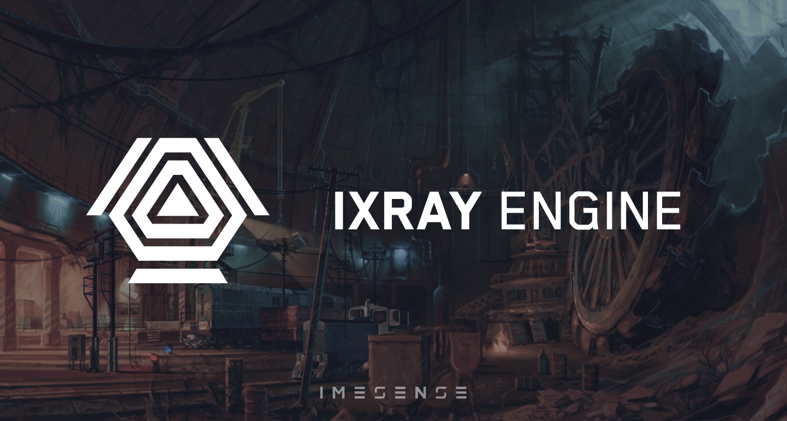

# IX-Ray

<div>
  <p>
    <a href="https://github.com/ixray-team">
      
    </a>
  </p>

  <p>
    <a href="./LICENSE.md">
      
    </a>
    <a href="https://github.com/ixray-team/ixray-1.6-stcop/releases/tag/r0.8">
      
    </a>
    <a href="https://github.com/ixray-team/ixray-1.6-stcop/releases">
      
    </a>
    <br />
    <a href="https://github.com/ixray-team/ixray-1.6-stcop/actions/workflows/build-engine.yml">
      
    </a>
    <a href="https://github.com/ixray-team/ixray-1.6-stcop/actions/workflows/build-server.yml">
      
    </a>
    <a href="https://github.com/ixray-team/ixray-1.6-stcop/actions/workflows/build-utilities.yml">
      
    </a>
  </p>
</div>

Stable repository of the modernized _X-Ray_ 1.6 game engine

## Requirements

For building:

- Visual Studio 2022 Community Edition
  - MFC
  - C++/CLI
  - Windows SDK 10.0.19041.0+
- Git
- CMake

For development:

- Visual Studio 2022 Community Edition
- Git
- CMake with CMake GUI

## Building

The project can be built in various ways. Choose the most convenient one and follow the steps

Download the repository firstly:

```sh
git clone https://github.com/ixray-team/ixray-1.6-stcop.git
```

### CMake GUI with Visual Studio

To generate `build` folder and solution:

- Open CMake GUI
- Press `Browse Source...` button and open folder with the project
- Select necessary preset from drop-down list
- Press `Configure` button and then `Generate` button

To build the project after generating solution:

- Open generated solution in Visual Sudio
- Select necessary build config
- Build solution

### CMake with console

To build from the console follow steps below

- Select one of preset from the list and configure project:

  - `Engine-x86`
  - `Engine-x64`
  - `Server-x86`
  - `Server-x64`
  - `Utilities-x86`
  - `Utilities-x64`
  - `Plugins-3ds-Max-x64`
  - `Plugins-Lightwave-x64`
  - `Compressor-x86`
  - `Compressor-x64`

  ```sh
  cmake --preset preset-name
  # For example:
  # cmake --preset Engine-x64
  ```

- Select build configuration from the list and build project:

  - `Debug`
  - `RelWithDebInfo`
  - `Release`

  ```sh
  cmake --build --preset preset-name-configuration
  # For example:
  # cmake --build --preset Engine-x64-Debug
  ```

- Run `generate-patch.bat` to get modified files and packed assets

## Changelog

All significant changes to this repository are documented in [this](CHANGELOG.md) file

## License

Contents of this repository licensed under terms of the custom MIT-like non-commercial license unless otherwise specified. See [this](./LICENSE.md) file for details

## Support

Project is being developed with the support of these tools

<div>
  <a href="https://pvs-studio.ru/ru/pvs-studio/?utm_source=website&utm_medium=github&utm_campaign=open_source" align="right">
    
  </a>

  <br/>

  [__PVS-Studio__](https://pvs-studio.ru/ru/pvs-studio/?utm_source=website&utm_medium=github&utm_campaign=open_source) - static analyzer for C, C++, C#, and Java code
</div>
