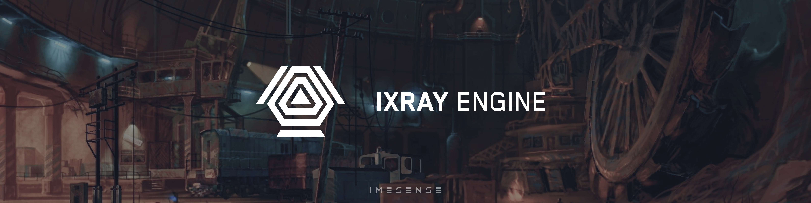

<div align="center">
  <h1>IX-Ray Engine 1.6</h1>

  <h4>Stable repository of the modernized <i>X-Ray 1.6</i> game engine</h4>

  <p>
    English
    |
    <a href="./doc/README.rus.md">
      Русский
    </a>
  </p>

  <p>
    <a href="https://github.com/ixray-team">
      
    </a>
  </p>

  <p>
    <a href="./LICENSE.md">
      
    </a>
    <a href="https://github.com/ixray-team/ixray-1.6-stcop/releases/tag/r1.0">
      
    </a>
    <a href="https://github.com/ixray-team/ixray-1.6-stcop/releases">
      
    </a>
    <a href="https://github.com/ixray-team/ixray-1.6-stcop/graphs/contributors">
      
    </a>
    <br />
    <a href="https://github.com/ixray-team/ixray-1.6-stcop/actions/workflows/build-engine.yml">
      
    </a>
    <a href="https://github.com/ixray-team/ixray-1.6-stcop/actions/workflows/build-server.yml">
      
    </a>
    <a href="https://github.com/ixray-team/ixray-1.6-stcop/actions/workflows/build-utilities.yml">
      
    </a>
    <br />
    <a href="https://github.com/ixray-team/ixray-1.6-stcop/actions/workflows/nonunity-build.yml">
      
    </a>
  </p>
</div>

## Overview

__IX-Ray__ is fork of __X-Ray 1.6__ engine that aims to improve gaming experience and simplify development of modifications

Common purposes of the project is improving developer and gaming experience, fixing a lot of bugs of the original engine and extending support for new features

## Quick start

Latest release of the engine can be downloaded on the [releases page](https://github.com/ixray-team/ixray-1.6-stcop/releases)

## Features

- Architectures support: __x64__
- __CMake__ build system
- Supported renderers: __DirectX 9.0c__, __DirectX 11__
- Improved performance and better FPS
- [Extended opportunities for modmakers](https://github.com/ixray-team/ixray-1.6-stcop/wiki)
- Fixed original bugs
- Increased level loading speed by 3-4 times
- [Debugging tools support: __ASAN__, __RenderDoc__ and __LuaPanda__](https://github.com/ixray-team/ixray-1.6-stcop/wiki/%D0%98%D0%BD%D1%82%D0%B5%D0%B3%D1%80%D0%B0%D1%86%D0%B8%D0%B8)
- [Supported __DLTX__ and __XMLOverride__](https://github.com/ixray-team/ixray-1.6-stcop/wiki#addons)
- Supported in-game debugging tools
- [Supported __TTF__ font system](https://github.com/ixray-team/ixray-1.6-stcop/wiki/Fonts)
- Extended rendering features
- Supported __BC7__ compression format
- Supported NVIDIA DLSS and AMD FidelityFX Super Resolution 2 (FSR2) Technologies
- Extended gameplay features
- [Extended __UI__ features](https://github.com/ixray-team/ixray-1.6-stcop/wiki/UI:-%D0%9E%D0%B1%D1%89%D0%B5%D0%B5)
- [Extended __Lua__ features](https://github.com/ixray-team/ixray-1.6-stcop/wiki#%D1%81%D0%BA%D1%80%D0%B8%D0%BF%D1%82%D1%8B-lua)

## Minimal system requirements

- OS: __Windows 7 SP1__ with installed [Platform Update](https://msdn.microsoft.com/en-us/library/windows/desktop/jj863687.aspx) or newer
- CPU: Supports __SSE2__ and newer instructions
- RAM: 6 GB
- GPU: Support for __Shader Model 3.0__ or newer
- GPU VRAM: 512 MB
- DirectX: __9.0с__ or newer

## Requirements

For launching:

- [OpenAL Driver](https://www.openal.org/downloads/)
- [Visual C++ Redistributable](https://www.microsoft.com/en-gb/download/details.aspx?id=48145)
- [DirectX End-User Runtime](https://www.microsoft.com/en-us/download/details.aspx?id=35)

- Install original game from Steam or GOG
- Delete in main folder of the game: `bin`, `gamedata` (if exists)
- Unpack archive to main folder of the game

For building:

- [Visual Studio 2022 Community Edition](https://visualstudio.microsoft.com/vs/community/)
  - MFC
  - Windows SDK 10.0.19041.0+
- [Git](https://git-scm.com/downloads)
- [CMake](https://cmake.org/download/)

For development:

- [Visual Studio 2022 Community Edition](https://visualstudio.microsoft.com/vs/community/)
- [Git](https://git-scm.com/downloads)
- [CMake with CMake GUI](https://cmake.org/download/)

## Building

The project can be built in various ways. Choose the most convenient one and follow the steps

Download the repository firstly:

```sh
# From GitHub
git clone https://github.com/ixray-team/ixray-1.6-stcop.git
# Or from GitLab
git clone https://gitlab.com/ixray-team/ixray/ixray-1.6-stcop.git
```

### Generate Visual Studio solution

To generate a solution with default settings from the console, follow the steps below:

  ```sh
  cmake -B build
  ```

To build the project after generating solution:

- Open generated solution in Visual Sudio
- Select necessary build config
- Build solution

### CMake GUI with Visual Studio

To generate `build` folder and solution:

- Open CMake GUI
- Press `Browse Source...` button and open folder with the project
- Select necessary preset from drop-down list
- Press `Configure` button and then `Generate` button

To build the project after generating solution:

- Open generated solution in Visual Sudio
- Select necessary build config
- Build solution

### CMake with console

To build from the console follow steps below

- Select one of preset from the list and configure project:

  - `Engine-x86`
  - `Engine-x64`
  - `Server-x86`
  - `Server-x64`
  - `Utilities-x86`
  - `Utilities-x64`
  - `Plugins-3ds-Max-x64`
  - `Plugins-Lightwave-x64`
  - `Compressor-x86`
  - `Compressor-x64`

  ```sh
  cmake --preset <preset-name>
  # For example:
  # cmake --preset Engine-x64
  ```

- Select build configuration from the list and build project:

  - `Debug`
  - `RelWithDebInfo`
  - `Release`

  ```sh
  cmake --build --preset <preset-name-configuration>
  # For example:
  # cmake --build --preset Engine-x64-Debug
  ```

- Run script to get modified files and packed assets:

  ```sh
  .\util\generate-patch.bat
  ```

## Changelog

All significant changes to this repository are documented in [this](./CHANGELOG.md) file

## License

Contents of this repository licensed under terms of the custom MIT-like non-commercial license unless otherwise specified. See [this](./LICENSE.md) file for details

## Support

Project is being developed with the support of these tools

<div>
  <a href="https://pvs-studio.ru/ru/pvs-studio/?utm_source=website&utm_medium=github&utm_campaign=open_source" align="right">
    
  </a>

  <br/>

  [__PVS-Studio__](https://pvs-studio.ru/ru/pvs-studio/?utm_source=website&utm_medium=github&utm_campaign=open_source) - static analyzer for C, C++, C#, and Java code
</div>
