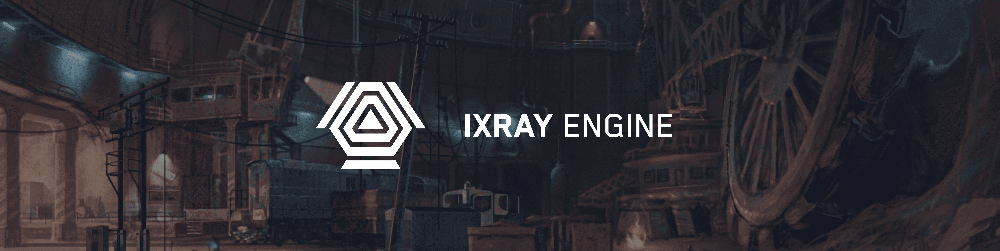

<div align="center">
  <h1>IX-Ray Engine 1.6</h1>

  <h4>Стабильный репозиторий модернизированного игрового движка <i>X-Ray 1.6</i></h4>

  <p>
    <a href="../.github/README.md">
      English
    </a>
    |
    Русский
  </p>

  <p>
    <a href="https://github.com/ixray-team">
      
    </a>
  </p>

  <p>
    <a href="../LICENSE.rus.md">
      
    </a>
    <a href="https://github.com/ixray-team/ixray-1.6-stcop/releases/latest">
      
    </a>
    <a href="https://github.com/ixray-team/ixray-1.6-stcop/releases">
      
    </a>
    <a href="https://github.com/ixray-team/ixray-1.6-stcop/graphs/contributors">
      
    </a>
    <br />
    <a href="https://www.youtube.com/UC1FjS8KwKAHJhSoNkpQ9BvQ">
      
    <a href="https://www.youtube.com/UC1FjS8KwKAHJhSoNkpQ9BvQ">
      
    </a>
    <a href="https://discord.gg/hWTbHxaYWz">
      
    </a>
    <a href="https://t.me/ixray_platform">
      
    </a>
    <br />
    <a href="https://github.com/ixray-team/ixray-1.6-stcop/actions/workflows/build-engine.yml">
      
    </a>
    <a href="https://github.com/ixray-team/ixray-1.6-stcop/actions/workflows/build-server.yml">
      
    </a>
    <br />
    <a href="https://github.com/ixray-team/ixray-1.6-stcop/actions/workflows/build-editors.yml">
      
    </a>
    <a href="https://github.com/ixray-team/ixray-1.6-stcop/actions/workflows/build-utilities.yml">
      
    </a>
    <a href="https://github.com/ixray-team/ixray-1.6-stcop/actions/workflows/build-plugins.yml">
      
    </a>
    <br />
    <a href="https://github.com/ixray-team/ixray-1.6-stcop/actions/workflows/nonunity-build.yml">
      
    </a>
  </p>
</div>

## Обзор

__IX-Ray__ - это форк движка __X-Ray 1.6__, который направлен на улучшение игрового процесса и упрощение разработки модификаций

Общими целями проекта являются улучшение опыта разработки и игрового опыта, исправление множества ошибок оригинального движка и расширение поддержки новых функций

## Поддержка проекта

Если вам нравится этот проект, вы можете поддержать его развитие на Boosty. Подписывайтесь, чтобы получать эксклюзивный контент и участвовать в голосованиях о развитии проекта!

Мы также будем рады обычной звездочки, поставленной на репозиторий!

[](https://boosty.to/ixray_platform)

## Быстрый старт

Последнюю версию движка можно скачать на странице [релизов](https://github.com/ixray-team/ixray-1.6-stcop/releases)

### Скачать готовые сборки

| Платформа | Сборка | Система | Файлы | Описание |
| :--- | :--- | :--- | :--- | :--- |
| Зов Припяти | Игровая | Windows x64 | [Engine+Assets](https://github.com/ixray-team/ixray-1.6-stcop/releases/download/r1.3.5/ixray-1.6-r1.3.5-engine-x64-game-cop.zip) | Готовая сборка движка для игроков или необходимая для выпуска модификаций. Архив содержит движок и ресурсы для запуска игры |
| Зов Припяти | Для разработки | Windows x64 | [Engine+Assets](https://github.com/ixray-team/ixray-1.6-stcop/releases/download/r1.3.5/ixray-1.6-r1.3.5-engine-x64-develop-cop.zip) | Готовая сборка движка для разработчиков, необходимая для удобной разработки модификаций. Архив содержит движок и ресурсы для запуска игры |

Прочитать о различиях можно в [FAQ](https://github.com/ixray-team/ixray-1.6-stcop/blob/default/doc/faq.rus.md#%D1%87%D0%B5%D0%BC-%D0%BE%D1%82%D0%BB%D0%B8%D1%87%D0%B0%D0%B5%D1%82%D1%81%D1%8F-%D0%B1%D0%B8%D0%BB%D0%B4-%D0%B4%D0%BB%D1%8F-%D0%B8%D0%B3%D1%80%D0%BE%D0%BA%D0%B0-%D0%B8-%D1%80%D0%B0%D0%B7%D1%80%D0%B0%D0%B1%D0%BE%D1%82%D1%87%D0%B8%D0%BA%D0%B0)

## Возможности

- Поддержка архитектур: __x64__
- Поддерживается Visual Studio 2019-2026
- Система сборки __CMake__
- Поддерживаемые рендеры: __DirectX 9.0c__, __DirectX 11__
- Улучшенная производительность и повышенный FPS
- Загрузка уровней ускорена в 3-4 раза
- [Расширены возможности для модмейкеров](ixray-team.github.io/ixray-1.6-stcop/)
- Исправление оригинальных ошибок
- [Поддержка инструментов отладки: __ASAN__, __RenderDoc__ и __LuaPanda__](https://github.com/ixray-team/ixray-1.6-stcop/wiki/%D0%98%D0%BD%D1%82%D0%B5%D0%B3%D1%80%D0%B0%D1%86%D0%B8%D0%B8)
- [Поддержка __DLTX__ и __XMLOverride__](https://github.com/ixray-team/ixray-1.6-stcop/wiki#addons)
- [Поддержка внутриигровых инструментов отладки](https://github.com/ixray-team/ixray-1.6-stcop/wiki/In%E2%80%90Game-debugging-tools)
- [Поддержка системы __TTF__ шрифтов](https://github.com/ixray-team/ixray-1.6-stcop/wiki/Fonts)
- Расширены возможности рендеринга
- Поддержка формата сжатия __BC7__
- Поддержка технологий NVIDIA DLSS и AMD FidelityFX Super Resolution 2 (FSR2)
- Расширены возможности геймплея
- [Расширены возможности __UI__](https://github.com/ixray-team/ixray-1.6-stcop/wiki/UI-%D0%9E%D0%B1%D1%89%D0%B5%D0%B5)
- [Расширены возможности  __Lua__](https://github.com/ixray-team/ixray-1.6-stcop/wiki#%D1%81%D0%BA%D1%80%D0%B8%D0%BF%D1%82%D1%8B-lua)

## Аддоны

Мы размещаем официальные аддоны в нашей организации [IX-Ray Community](https://github.com/ixray-community). Там вы найдете оружейные и графические аддоны

Помимо этого, аддоны можно скачать с [ModDB](https://www.moddb.com/mods/ix-ray-platform/addons)

## Минимальные системные требования

- ОС: __Windows 7 SP1__ с установленным [Platform Update](https://msdn.microsoft.com/en-us/library/windows/desktop/jj863687.aspx) или новее
- ЦПУ: Поддержка __SSE2__ или более новых инструкций
- ОЗУ: 4 Гб
- ГПУ: Поддержка __Shader Model 3.0__ или новее
- ГПУ VRAM: 512 Мб
- DirectX: __9.0с__ или новее

## Требования

Для запуска:

- [OpenAL Driver](https://www.openal.org/downloads/)
- [Visual C++ Redistributable](https://www.microsoft.com/en-gb/download/details.aspx?id=48145)
- [DirectX End-User Runtime](https://www.microsoft.com/en-us/download/details.aspx?id=35)
- Установите оригинальную игру
- Удалите в основной папке игры: `bin`, `gamedata` (при наличии)
- Распакуйте архив в основную папку игры с заменой файлов

Для сборки:

- [Visual Studio 2022 (или 2026) Community Edition](https://visualstudio.microsoft.com/vs/community/)
  - Windows SDK 10.025+
- [Git](https://git-scm.com/downloads)
- [CMake](https://cmake.org/download/)

Для разработки:

- [Visual Studio 2022 (или 2026) Community Edition](https://visualstudio.microsoft.com/vs/community/)
- [Git](https://git-scm.com/downloads)
- [CMake with CMake GUI](https://cmake.org/download/)

## Сборка

Проект может быть собран различными способами. Выберите наиболее удобный из них и следуйте инструкциям

Сначала скачать репозиторий:

```sh
# С GitHub
git clone https://github.com/ixray-team/ixray-1.6-stcop.git
```

> [!IMPORTANT]
> Подготовка системы перед сборкой
>
> Чтобы избежать ошибок, выполните два обязательных условия:
>
> 1. Отключите сторонние сетевые инструменты:
>     - Обходы DPI
>
> 2. Включите поддержку длинных путей в Windows:
>     - Это системное ограничение на 260 символов в пути к файлу
>     - Примечание: В новых версиях Windows 10/11 этот параметр часто включён по умолчанию. Проверить можно командой `fsutil behavior query LongPathsEnabled` в терминале с правами администратора. Если выведет `1` — включено

### CMake GUI с Visual Studio

Чтобы сгенерировать папку `build` и решение:

- Открыть CMake GUI
- Нажать кнопку `Browse Source...` и открыть папку с проектом
- Выбрать необходимые опции в категории `IXRAY`
- Нажать кнопку `Configure` и затем кнопку `Generate`

Чтобы собрать проект после генерации решения:

- Открыть сгенерированное решение в Visual Sudio
- Выбрать необходимую конфигурацию сборки
- Собрать решение

### Генерация решения Visual Studio

Чтобы сгенерировать решение с настройками по умолчанию с помощью консоли, выполнить следующие действия:

  ```sh
  cmake -B build
  ```

Для сборки проекта после генерации решения:

- Открыть сгенерированное решение в Visual Sudio
- Выбрать необходимую конфигурацию сборки
- Собрать решение

## Список изменений

Все значимые изменения в этом репозитории задокументированы в [этом](./CHANGELOG.rus.md) файле

## Лицензия

Содержимое этого репозитория лицензировано на условиях пользовательской некоммерческой MIT-подобной лицензии, если не указано иное. Подробности смотрите в [этом](./LICENSE.rus.md) файле

## Поддержка

Проект разрабатывается при поддержке этих инструментов

<div>
  <a href="https://pvs-studio.ru/ru/pvs-studio/?utm_source=website&utm_medium=github&utm_campaign=open_source" align="right">
    
  </a>

  <br/>

  [__PVS-Studio__](https://pvs-studio.ru/ru/pvs-studio/?utm_source=website&utm_medium=github&utm_campaign=open_source) - статический анализатор для C, C++, C# и Java кода
</div>
