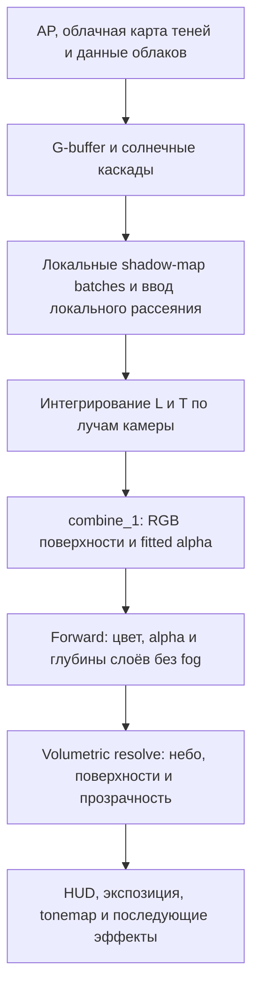

# Перенос тумана в volumetric: план R4 / D3D11

Статус: проект реализации, 2026-10-02. Этот документ не означает, что описанные проходы уже реализованы. Изменения движка и шейдеров выполняются отдельными этапами после этого плана.

## Результат и обязательные свойства

Вычисление атмосферного и локального тумана принадлежит подсистеме volumetric. Материалы forward не вычисляют fog factor, не смешивают цвет с `fog_color` и не изменяют прозрачность материала из-за атмосферного тумана.

Результат интегрирования до расстояния `d` — накопленная яркость `L(d)` и RGB-пропускание `T(d)`. Непрозрачная поверхность композится как `C * T(d) + L(d)`. Солнечное и локальное освещение используют одну среду; поглощение учитывается один раз.

В `combine_1` сохраняется вычисление fitted fog alpha для художественного перехода геометрии в фон. Это отдельная маска покрытия, а не повторное физическое поглощение.

Туман работает ночью, при отсутствии локальных источников и при выключенных sun shafts. Пустая карта означает отсутствие локальной добавочной среды, но не отключает атмосферу AP. Непрозрачный и прозрачный HUD обрабатываются отдельно от мирового тумана.

## Что уже есть в коде

| Место | Текущее поведение | Что меняется |
| --- | --- | --- |
| `accum_direct_volumetric()` / `accum_volumetric_sun.ps.hlsl` | Аддитивные солнечные лучи; 6/12/18 шагов; только каскад 2; плотность зависит от sun shafts | Общий интегратор среды с независимым жизненным циклом |
| `accum_volumetric_lv()` / `pfx_volumetric_light.ps.hlsl` | Отдельное накопление локальных лучей | Ввод источников рассеяния в общую среду |
| `phase_vol_accumulator()` / `combine_volumetric` | Общий `rt_Generic_2`, сложение ONE/ONE | Собственные ресурсы среды и композиция с пропусканием |
| `ComputeAP.cs.hlsl` | Три накопленных объёма: ambient, direct, RGB T | Сохраняются как входные данные атмосферы |
| `combine_1.ps.hlsl` | Применяет AP к RGB; считает Fog, но возвращает alpha 0 | Выдаёт RGB поверхности и fitted alpha; применение AP переносится |
| `blender_combine.cpp`, element 0 | INVSRCALPHA / SRCALPHA поверх неба | Семантика смешивания сохраняется в resolve, после обработки среды |
| `ComputeCloudsView.cs.hlsl` | Применяет AP к облакам на средней глубине | Выдаёт также исходную яркость и глубину; AP-композиция переходит в resolve |
| `sky.ps.hlsl` | Собирает уже атмосферное небо, облака и диск | Компоненты сохраняются раздельно до композиции среды |

`rt_Generic_2` используется и другими эффектами, поэтому не становится постоянным хранилищем `L/T`. При переносе также пересматриваются очистки и `m_bHasActiveVolumetric`.

## Импорт карты тумана

### Координаты

Эталон привязки находится в архиве `docs/archives/hf_sun_shadows_rollback_20260928_000954/working-tree/`, в `r4_rendertarget_phase_heightfield_sun.cpp`, функции `bind_heightfield_sun()`.

Для Юпитера карта 2048×2048 покрывает X/Z от -600 до +600 метров:

```hlsl
float2 uv = world_position.xz * float2(1.0 / 1200.0, -1.0 / 1200.0)
          + float2(0.5, 0.5);
```

U направлена вдоль +X, V вдоль -Z; размер texel — 0.5859375 м. Это фиксированная world-space привязка, не camera-relative матрица облачных теней.

Общий параметр `fog_world_to_uv = (1/dx, -1/dz, -xmin/dx, zmax/dz)`, где `dx=xmax-xmin`, `dz=zmax-zmin`. Границы берутся из метаданных уровня, а не из автоматически меняющегося bounding box сцены. Для других уровней не подставлять калибровку Юпитера молча.

Исходное преобразование HF `worldY = 84.03596 - 114.82738 * normalized_depth` относится только к захвату глубины. Для G/B карты тумана используется собственная явно заданная шкала абсолютных мировых высот.

### Формат и метаданные

Предлагаемые имена, подлежащие введению: `$level$/fog_map.dds` и секция `[volumetric_fog]` в конфигурации уровня. Формат первой версии — RGBA8_UNORM, ровно 2048×2048, один mip, без BC-сжатия, sRGB и premultiplied alpha. Память — 16 МиБ. Если точности высот недостаточно, тот же контракт допускает RGBA16_UNORM с явно указанным форматом.

| Канал | Декодирование |
| --- | --- |
| R | `sigma_t = R * extinction_max_m_inv * density_scale` |
| G | `bottom_m = height_origin_m + G * height_range_m` |
| B | `top_m = height_origin_m + B * height_range_m` |
| A | Для RGBA8: `palette_index = round(A * 255)`; не прозрачность |

Метаданные: `bounds_xz`, `height_origin_m`, `height_range_m`, `extinction_max_m_inv`, `density_scale`, `edge_softness_m`, идентификатор палитры и политика внешней границы. Для RGBA16 способ кодирования индекса также фиксируется явно; он не выводится из числа элементов палитры.

Палитра содержит 256 записей с RGB single-scattering albedo в линейном пространстве, в диапазоне [0,1]. Авторские sRGB-цвета конвертируются при загрузке палитры. Эмиссия тумана не подразумевается. Фазовый параметр `g` в первой версии общий, а не скрыто закодированный в цвете.

При `R=0` или `top<=bottom` вклад texel нулевой. Плотность плавно входит в вертикальный интервал и выходит из него; ширина перехода не превышает половину толщины зоны. За интервалом плотность равна нулю. Нет карты — локальная плотность нулевая. Неверный формат или метаданные дают однократную диагностику и тот же безопасный пустой ресурс.

Один texel хранит один вертикальный интервал. Пещеры, отдельные этажи и исключения внутри помещений не кодируются этим форматом; при необходимости добавляются отдельными масками/объёмами, а не интерпретацией пустот в heightfield.

### Фильтрация

Не интерполировать A как число перед lookup палитры. Для четырёх соседних texel отдельно декодировать высоты, профиль плотности в текущем Y и цвет. Затем смешать коэффициенты среды с билинейными весами:

```text
sigma_t(P) = sum(weight_i * sigma_t_i(P.y))
sigma_s(P) = sum(weight_i * sigma_t_i(P.y) * albedo_i)
```

Так пустая соседняя колонка не смещает высоту занятой зоны, а между индексами палитры не появляются посторонние цвета. Это также определяет поведение на стыке разных интервалов высоты.

Обычные mipmaps RGBA не строить. Для ускорения допускается отдельная консервативная иерархия: максимальная плотность, минимальный низ и максимальный верх занятых дочерних областей. Пропускать участок можно только при доказанном отсутствии среды, с учётом области поддержки фильтра.

### Края уровня

Для Юпитера сохраняется точное покрытие 1200×1200 м; произвольное расширение bounds растянет нарисованные зоны. Внешняя полоса тумана рисуется внутри согласованного покрытия. За ним в первой версии продолжается ближайшая граничная колонка (clamp), без wrap и без затухания плотности к нулю.

Двухметровый fade покрытия из HF-теней не переносится. На каждой поддерживаемой высоте камеры проверяется, что среда либо fitted fade скрывает clipping. Высокий наблюдатель может видеть над туманной зоной: одна плотная полоса по XZ этого не решает.

## Данные и порядок проходов



Это порядок зависимостей, а не требование перенести весь существующий sky pass физически на новое место. Он может заранее готовить отдельный фон. Интегратор запускается после доступности солнечных теней и ввода локальных источников, до потребления `L/T` в resolve. Локальные shadow maps используются при вводе света до переиспользования atlas.

Новые ресурсы, имена предварительные:

| Ресурс | Назначение |
| --- | --- |
| `s_fog_map`, палитра и bounds | Статические данные уровня |
| `volume_local_source` | RGB источника рассеяния на единицу пути; очищается каждый кадр |
| `volume_scattering` | Накопленный RGB L, RGBA16F |
| `volume_transmittance` | Накопленный RGB T, RGBA16F; служебный канал отдельно документируется |
| `deferred_surface` | RGB освещённой поверхности, A = FogFit |
| Отдельные sky/cloud-данные | SkyView, raw cloud radiance/opacity, согласованная cloud depth |
| Прозрачные слои | Цвет/alpha/глубина и тип смешивания до применения среды |

Для собственного ввода света сетка та же, что у интегратора. Рассеяние между центрами ячеек интерполируется; это отдельная аппроксимация и предмет проверки тонких лучей.

## Основной ray march

### Сетка, единицы и границы

Интегратор — compute-проход: поток обрабатывает UV-колонку и записывает префиксы по расстоянию. Начальная эталонная версия допускает дорогой полноразмерный расчёт без истории. Производственная отправная точка — XY в 1/8 внутреннего разрешения и 64 слоя, с последующим подбором по измерениям.

Расстояние вдоль луча измеряется в метрах, а не view Z. Мировые позиции для карты тумана — в метрах; AP и облачные матрицы получают явное преобразование через `SKY_WORLD_TO_KM`. Художественная высота атмосферы остаётся такой же, как в `ComputeAP`; её не подставлять вместо world Y карты тумана.

Глубины нелинейные, с большей детализацией рядом с камерой. Сетка тумана не наследует распределение 64 слоёв AP на 120 км. Диапазон `volume_max_distance_m` выбирается явно для уровня/качества и охватывает рабочие расстояния локального тумана и теней. За ним разрешён аналитический AP-tail только при отсутствии меняющейся локальной среды; clamp последнего слоя вместо продолжения интеграла запрещён.

Плотная продолжающаяся граничная зона может потребовать полного интегрирования до практически нулевого T. Выход разрешён по малости максимального RGB T с заполнением оставшихся префиксов терминальным значением и контролем ошибки ярких источников. Простое ограничение старым `fog_params.z` не является критерием завершения.

Лучи объёма не обрезаются произвольно по одному opaque depth низкого разрешения: соседние пиксели и прозрачные слои могут потребовать большие расстояния. Финальный resolve выбирает префикс по фактической глубине. Для сокращения диапазона нужен консервативный максимум требуемых глубин.

### Интегрирование атмосферы и карты

March идёт от камеры наружу. Для участка [a,b] длины ds берутся атмосферные префиксы `A`, `D`, `Ta` из трёх существующих AP-текстур:

```text
ta = Ta(b) / Ta(a)
dA = (A(b) - A(a)) / Ta(a)
dD = (D(b) - D(a)) / Ta(a)
sigma_a = -log(ta) / ds
I(sigma, ds) = (1 - exp(-sigma * ds)) / sigma
j_a = dA / I(sigma_a, ds)
j_d = dD / I(sigma_a, ds)
```

Все RGB операции покомпонентные. Здесь `sigma_a` обозначает эффективную атмосферную экстинкцию, а не только absorption. При sigma→0 функция I стремится к ds. При ds=0 интегрирование пропускается. В почти непрозрачных каналах деление префиксов не выполняется без проверки; используется контролируемое завершение либо прямое вычисление атмосферных коэффициентов.

Это восстановление постоянного источника участка из накопленного AP, а не точное восстановление спектральной среды. Пропускание в существующем AP уже является RGB-аппроксимацией. Предел её точности и ошибки интерполяции проверяются отдельно.

Объединение с туманом:

```text
sigma = sigma_a + sigma_fog
j = j_a + V_sun * j_d + j_fog_sun + j_fog_ambient + j_local
L += T * j * I(sigma, ds)
T *= exp(-sigma * ds)
```

`j_local` уже включает локальную плотность, фазу и видимость источника; повторно умножать его на sigma_s нельзя. Старые density/fogTint, far whitening и добавочный интеграл sun shafts исключаются из новой ветки.

Нулевая локальная плотность и V_sun=1 должны воспроизводить исходный AP на концах участков с учётом численной точности. На промежуточных расстояниях допускается только измеренная ошибка дискретизации/интерполяции.

### Освещение и тени

```text
V_sun = V_scene * T_cloud * T_fog_to_sun
```

Выбирать CSM-каскад для текущей мировой позиции, сглаживать переходы между каскадами. За их покрытием сохраняются облачные тени; отсутствие данных о геометрии означает явный fallback, а не затухание всей среды.

`T_cloud` вычисляется по предварительной карте облачных теней, с её матрицей и интервалом tau. Её формат нельзя трактовать как обычную depth shadow map. Тени умножают direct-источник, но не весь ambient.

Для рассеяния локального тумана нужны локальное солнечное освещение и нормированная фаза. Использовать согласованные с атмосферой солнечный источник и transmittance LUT; три AP-префикса сами по себе не являются произвольным локальным полем освещения. Не использовать накопленный `AP_ambient(d)` как освещённость частицы тумана и не переносить солнечный `AP_direct` на лампы.

В эталонной версии `T_fog_to_sun` проверяется дополнительным march к солнцу. В варианте качества без самозатенения он явно равен 1; это документированная аппроксимация, заметная в плотных зонах. Производственный способ предварительного расчёта выбирается после замера, без обещания бесплатного самозатенения.

Архивный HF не восстанавливается как обязательная зависимость карты тумана. При отдельном подключении дальних теней пригоден `s_hf_sun_ceiling` и сравнение с Y текущей точки, но не экранный HF visibility для G-buffer. CSM и HF описывают перекрывающиеся окклюдеры: их объединение не должно дважды затемнять одну геометрию. Облачное пропускание умножается отдельно.

### Шаги и устойчивость

Границы записываемых префиксов фиксированы в пространстве камеры; jitter меняет точку оценки внутри участка, а не расстояние, которому соответствует записанный слой. При необходимости участок дробится на подшаги. Тонкая зона не должна полностью пропадать из-за смещения всех выборок мимо неё.

Пустой texel не является доказательством пустоты всего следующего шага. Для крупных пропусков используется только консервативная иерархия. Изменения высот, плотности и теней требуют уменьшения шага либо достаточной эталонной частоты выборок.

Сначала получить правильный результат без temporal. Затем добавить reprojection с координатами точки в предыдущем объёме, проверкой валидности истории и стабильным шаговым jitter. Изменение солнца, погоды, карты, уровня, разрешения или камеры сбрасывает/снижает историю. Старую границу opaque depth не использовать как границу самой среды.

Для истории предпочтительно фильтровать L и optical depth `tau=-log(T)` раздельно; результат должен оставаться неотрицательным и монотонным по T вдоль луча. Это не автоматическая гарантия физической корректности: после фильтрации проверять утечки света и нарушения префиксных свойств.

## Fitted alpha в combine_1

Выход `combine_1`: `float4(surface_radiance, FogFit)`. Применение AP к RGB удаляется только одновременно с включением нового resolve.

```text
x = saturate((distance - fade_start) / (fade_end - fade_start))
E(x) = 1 - exp(-(a*x + b*x*x + c*x*x*x))
FogFit = E(x) / E(1)
```

`a,b,c>=0`, сумма положительна; при вырожденных коэффициентах используется явно заданная резервная кривая `x*x`. При `fade_end<=fade_start` конфигурация считается неверной. Для малых аргументов нужна устойчивая форма вычисления E. Коэффициенты подбираются по сохранённой целевой кривой появления фона с отчётом об ошибке, а не называются fitted после ручного назначения.

Эта маска предназначена для скрытия дальних границ геометрии и сохранения художественного перехода к небу. Она не приближает произвольную карту тумана и не зависит от теней. Физическое T и alpha материала не заменяются `1-FogFit`.

В resolve:

```text
surface_eye = T(d_surface) * surface_radiance + L(d_surface)
opaque_background = (1-FogFit) * surface_eye + FogFit * sky_eye
```

Таким образом сохраняется смысл прежнего INVSRCALPHA/SRCALPHA, но смешивание происходит после обработки среды для обеих альтернатив. Для `deferred_surface` аппаратный blend выключается; не смешивать RGB поверхности с уже атмосферным sky до resolve.

## Небо и облака без повторного AP

SkyView уже содержит атмосферу. Для ясного неба заменить только вычисленный префикс до D:

```text
clear_sky_new = L_new(D) + ratio(D) * (clear_sky_old - L_AP(D))
ratio(D) = T_new(D) / T_AP(D)
```

При модели `T_new=T_AP*T_fog` отношение можно получить непосредственно как `T_fog`, без нестабильного деления. Остаток неба за D остаётся исходным. При нулевой карте и незатенённой атмосфере формула тождественно возвращает старое небо.

Согласованность SkyView и AP на этом участке проверяется до включения: разные дискретизации могут давать отрицательный остаток. Не скрывать большие ошибки clamp-ом; при несовместимости нужен согласованный расчёт атмосферного tail. Для неоднородной среды за D формула требует продолжения интеграла, а не применения константного последнего T.

Облака отделяются от clear sky. Сохранить raw premultiplied cloud radiance, opacity и среднюю глубину по тем же весам, которыми получена яркость. Temporal cloud pass должен переносить их согласованно. AP из `ComputeCloudsView` удаляется, а облачная составляющая в resolve вычисляется как:

```text
cloud_eye = T(d_cloud) * cloud_raw + opacity * L(d_cloud)
sky_with_clouds = cloud_eye + (1-opacity) * clear_sky_new
```

Это сохраняет приближение облака одним слоем на средней глубине, уже применяемое в коде; точность для протяжённого облака/пересечения с туманом не заявляется. Диск солнца обрабатывается отдельно: существующее атмосферное ослабление не повторяется, дополнительное пропускание тумана применяется один раз, сохраняя выбранную модель видимости диска через облака.

## Forward и прозрачность

Удаление fog охватывает `forward_base`, `forwrad_interior`, воду, лужи, обычные и additive particles и остальные найденные fog-потребители. Проверка выполняется по семантике: soft particles, поглощение под водой и спад distortion не удаляются только из-за слова fog. WBOIT не должен получать alpha, изменённую атмосферой.

Простой fullscreen resolve по opaque depth после уже смешанной прозрачности неприемлем как точная реализация: он не знает расстояний стекла, воды и частиц. Строгий перенос всей обработки среды из материалов требует сохранить эти данные до смешивания.

Для проверки использовать depth peeling с настраиваемым числом слоёв (сначала один, затем четыре) и отдельным volumetric resolve. Это опорный путь D3D11 без требования pixel interlock. Каждый слой хранит premultiplied цвет, исходную alpha и расстояние; правила равных глубин, additive-слоёв и переполнения фиксируются отдельно. Production-способ сбора выбирается по профилированию, не подменяя его обещанием дешёвой прозрачности.

Для обычного alpha-blend слоя на глубине d:

```text
layer_eye_premultiplied = T(d) * layer_color_premultiplied + alpha * L(d)
C = layer_eye_premultiplied + (1-alpha) * C_behind_eye
```

Композиция идёт от дальних слоёв к ближним. Она эквивалентна интегрированию участков среды между alpha-поверхностями при одинаковом экранном луче; передний участок не добавляется повторно. Additive-слой даёт `T(d)*emission`, без добавления собственного L и без изменения покрытия. Его перекрытие ближними alpha-слоями учитывается порядком композиции.

Обычный WBOIT с единственной представительной глубиной остаётся отдельным приближённым режимом: точные `T(d_i)` и `L(d_i)` из его текущих двух агрегатов восстановить нельзя. Для overflow depth peeling допускается явно помеченный WBOIT-tail за сохранёнными слоями; это не точный результат для произвольного числа пересечений.

Рефракция меняет луч и требует отдельной проверки. Начальная поддержка distortion сохраняет существующую экранную аппроксимацию, а не обещает физический транспорт через преломляющую поверхность. Временный background resolve для рефракции не должен затем повторно получить полный fog. HUD depth `<0.02` не трактуется как обычная world depth; его маска/слой сохраняется отдельно.

## Память и жизненный цикл

При 1920×1080 сетка 240×135×64 и два RGBA16F-объёма требуют 31.64 МиБ. Одна копия истории этих двух объёмов добавляет столько же; `volume_local_source` RGBA16F — ещё 15.82 МиБ. Карта RGBA8 — 16 МиБ, без дополнительных ресурсов.

Четыре полноразмерных прозрачных слоя RGBA16F + R32F требуют около 94.92 МиБ, без depth-peeling ping-pong, velocity и flags. Это заметная стоимость строгого переноса fog из forward; оценку бюджета нельзя ограничивать только volumetric-текстурами.

Ресурсы пересоздаются при изменении внутреннего разрешения и reset; данные карты и palette — при загрузке/выгрузке уровня. История инвалидируется. UAV/SRV отвязываются между записью и чтением с учётом кэша RHI. При отсутствии локальных источников ресурс их вклада очищается, при отсутствии солнца обнуляется только соответствующий источник света.

## Этапы внедрения и критерии завершения

| Этап | Работа | Условие завершения |
| --- | --- | --- |
| 1. Импорт | Loader, метаданные, palette, world-to-UV, диагностические режимы | Углы/центр Юпитера совпадают с HF; индекс A не фильтруется; известна точность высот |
| 2. Среда | Эталонный интегратор карты и AP без temporal | Пустая карта воспроизводит AP; однородная среда совпадает с аналитикой; слои высот не пропускаются |
| 3. Солнце | CSM по точке, облачные тени, независимость от sun shafts, эталон самозатенения | Direct меняется от тени, ambient не исчезает; туман работает ночью |
| 4. Непрозрачная композиция | Новый surface target, FogFit, clear-sky prefix, raw cloud/depth | Нет двойного AP; FogFit=0/1 даёт ожидаемые пределы; края скрыты |
| 5. Forward | Слои/глубины, удаление старого fog, alpha/additive resolve, HUD/distortion | Стекло перед стеной имеет собственную глубину; alpha не зависит от fog; проверено переполнение |
| 6. Локальные источники | Ввод j_local во время shadow batches, общий интеграл | Перекрывающиеся лампы не удваивают extinction; проверены spot и OMNIPART |
| 7. Оптимизация | Размер сетки, история, реконструкция, пустые области | GPU-время и память измерены; ошибки сравнены с эталоном; нет утечек на границах |

Промежуточные версии держать за единым переключателем новой архитектуры. Не оставлять гибрид, где старый forward fog и новый resolve работают одновременно. Этапы 2–4 могут проверяться на opaque-only сценах, но не считаются завершением полного переноса.

Основные точки изменений: `r4_rendertarget.h/.cpp`, новый `r4_rendertarget_phase_volumetric.cpp`, соответствующий blender/compute shader, `r4_R_render.cpp`, `r4_loader.cpp`, `r__types.h`, `blender_combine.cpp`, `combine_1`, `combine_volumetric`, `ComputeCloudsView`, cloud temporal/sky composition и forward shaders. Новые файлы добавляются в действующую систему сборки; существующие пользовательские изменения в этих файлах сохраняются.

Отдельно проверить CPU-culling и clipping, связанные с `fog_distance`: `r4_R_render.cpp`, `r__dsgraph_build.cpp`, `Light_DB.cpp`, `ParticleEffect.cpp`, `DetailManager.cpp` и параметры камеры. Удаление shader fog не меняет эти ограничения. Сначала сохранить существующие дистанции и подобрать скрытие границ; увеличение дальности — отдельное измеряемое изменение.

## Проверки перед включением по умолчанию

- Карта: четыре угла, центр, отрицательные мировые координаты, переход через границу покрытия, камера снаружи, неверные метаданные, пустые/очень тонкие зоны, соседние несмежные индексы палитры.
- Интеграл: нулевая плотность, чистое поглощение, постоянные источники, sigma→0, деление AP при малом T, разные разбиения одного луча, RGB-пропускание.
- Солнце: границы каскадов, отсутствие CSM-покрытия, движущаяся облачная тень, низкое солнце, ночь, sun shafts off, видимая граница плотного тумана.
- Композиция: FogFit=0/1, небо без облаков, облака с нулевой/полной opacity, диск, камера внутри тумана и выше него, отсутствие повторного AP.
- Forward: ближнее стекло перед дальней стеной, два пересекающихся alpha-слоя, additive-частица перед/за стеклом, вода, distortion, HUD, overflow и WBOIT-аппроксимация.
- Динамика: движение камеры/солнца, teleport, изменение погоды, reload уровня, resize, reset, смена render scale, выключение источников без остатка истории.
- Производительность: отдельные GPU events для ввода света, интеграла, истории, прозрачных слоёв и resolve; не складывать время родительского события и его дочерних событий.

Для шейдерных/движковых этапов нужны компиляция затронутых shader variants, сборка R4 и визуальная проверка в игре. Проверки формул на CPU не заменяют эти проверки и не устанавливают GPU-бюджет.

На этапе подготовки плана выполнены 100 численных проверок аналитических однородных сред, включая нулевую атмосферную экстинкцию: восстановление AP из префиксов, смешанная экстинкция/источники, эквивалентность композиции двух alpha-слоёв посегментному интегрированию и замена префикса ясного неба. Максимальная абсолютная ошибка в double precision составила менее 4e-15. Эти проверки относятся к формулам, а не к существующим GPU-текстурам, многослойной рефракции или точности FP16.
