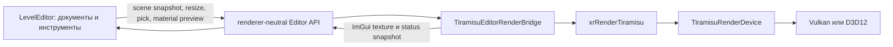

# Текущая реализация Tiramisu Render

> Снимок состояния: 24 июля 2026 года. Tiramisu остаётся стартовым
> прототипом и включается явно. Игровой R4 не удалён и остаётся fallback.

## Главная граница модулей

В процессе существует одно NRI-устройство Tiramisu. Им владеет
`TiramisuRenderDevice` из `xrRenderTiramisu`. LevelEditor больше не создаёт
собственный NRI device, graphics queue или streamer и не линкует NRI напрямую.

`TiramisuEditorRenderBridge` является editor-адаптером основного рендера, а не
вторым renderer. Он находится в `src/Layers/xrRenderTiramisu/Editor`, получает
устройство, очереди и NRI-интерфейсы у `TiramisuRenderDevice`, создаёт нужные
редактору render targets и возвращает наружу только непрозрачные ImGui handles
и структуры состояния.

## Запуск и выбор API

Игра запускает Tiramisu через `-r5`. Vulkan остаётся API по умолчанию,
`-dx12` выбирает D3D12. Для редактора используется `-tiramisu-editor`, а
`-dx12` имеет то же значение.

Все проверки Tiramisu без исключений выполняются с `-rdbg`. Этот аргумент
сохраняет shader debug information и включает согласованную debug policy.
При активном `-renderdoc` конфликтующие NRI/API validation layers отключаются,
но `-rdbg` не убирается.

## Владение ресурсами

`TiramisuRenderDevice` создаёт и уничтожает:

- одно `nri::Device` для выбранного API;
- graphics queue и, когда они доступны, отдельные compute/copy queues;
- NRI Core, Helper, SwapChain, Streamer и ImGui interfaces;
- общий NRI streamer с тремя queued frame contexts.

Игровой viewport и editor bridge создают собственные swapchain/target ресурсы,
но используют одно устройство. Это разные поверхности одного renderer, а не
два независимых renderer. LevelEditor получает экземпляр через C ABI factory
`CreateTiramisuEditorRenderer` и освобождает его тем же модулем через
`DestroyTiramisuEditorRenderer`.

GPU-ресурсы editor viewport не выходят за границу DLL. Публичные интерфейсы:

- `IEditorRenderBackend` принимает scene snapshots, resize, texture uploads и
  запросы picking;
- `IMaterialPreviewRenderer` обслуживает sphere/cube/plane preview;
- `IXrUIRendererBackend` принимает `ImDrawData` и выполняет presentation;
- `FTiramisuEditorRendererInstance` объединяет невладеющие указатели этих
  интерфейсов и непрозрачный lifetime handle.

## Потоки и кадр

Игровой путь имеет game thread и render thread. Game thread обновляет сцену и
публикует команды; NRI recording, pipeline/resource publication и deferred
удаление должны выполняться на render thread. Проверки `CheckIsGameThread` и
`CheckIsRenderThread` фиксируют нарушение контракта в debug-сборке.

Editor bridge формирует ImGui draw data на game thread и синхронно передаёт его
через общую очередь команд `xrRenderTiramisu`. На выделенном render thread его
frame scheduler выбирает один из трёх контекстов, ждёт fence только перед
повторным использованием контекста, обрабатывает scene/texture mailboxes,
обновляет uploads, рисует viewport/preview/ImGui и выполняет present. Создание и
удаление editor swapchain, pipelines, descriptors и targets также выполняется
на render thread. До запуска выделенного потока game thread временно выполняет
render-thread роль при bootstrap shared device и базовых ресурсов общего
renderer; device удаляется только после остановки потока.

Следующая внутренняя задача — заменить синхронную передачу `ImDrawData` на
тройные immutable UI packets и провести editor passes через общий
`TiramisuRenderGraph`, не меняя публичный API LevelEditor.

## Сцена редактора

LevelEditor не передаёт `CCustomObject`, `CEditableMesh` или NRI-указатели в
renderer. Он формирует `FEditorViewportSceneSnapshot`:

- mesh uploads с вершинами, индексами и секциями;
- instances с transform, object ID и material overrides;
- standalone OGF model instances с asset name, transform и object ID;
- material-slot sources или прямые ссылки на новые material assets;
- directional, point и spot lights;
- debug lines/triangles, screen-space overlay и owned text.

Snapshot копируется в mailbox. Renderer дедуплицирует geometry по стабильному
mesh ID/revision, обновляет только изменившиеся buffers, разрешает material
slots и публикует готовые pipeline/resources после fence безопасного frame
context. CPU picker использует тот же snapshot и возвращает object, mesh и
material IDs без раскрытия editor implementation.

Legacy Spawn visual передаётся как `FEditorModelInstance`, без
`IRenderVisual*`. Standalone OGF разбирается и кэшируется внутри
`xrRenderTiramisu`, после чего его draw-parts превращаются в обычные mesh
uploads/instances. Сейчас поддержаны static, progressive, embedded hierarchy
и skeletal draw-parts с 1–4 weights. Loader сохраняет для каждой
вершины до четырёх bone indices и нормализованные weights, а scene contract
передаёт необязательное имя `startup_animation` в renderer-owned mailbox.
Loader также читает bone hierarchy и bind transforms, вычисляет inverse-bind
матрицы и отклоняет out-of-range bone indices. Чистый renderer-owned pose
builder строит `current-model × inverse-bind` palette. OGF/OMF loader читает
embedded motions и внешние motion references, поддерживает compressed и
uncompressed tracks, loop/stop-at-end sampling и сохраняет current/previous
pose. Material GPU ABI v5 передаёт offsets обеих палитр в draw record,
inverse view-projection в scene constants и данные projective decals;
`MaterialSkeletalVertexFactory` читает матрицы через Descriptor Heap Indexing
и деформирует position/normal на GPU. Первый CPU I/O/parse выполняет bounded
background queue с одним worker; render thread только
публикует готовый cache entry, создаёт mesh buffers и повторно разворачивает
pending model instances. Shutdown отменяет pending jobs и ждёт активную.

После cache publication те же mesh updates и instances передаются в общий
mutex-защищённый `TiramisuEditorViewportScenePicker`. Поэтому native mesh и
standalone OGF возвращают одинаковые `FEditorViewportPickResult` с исходным
Spawn object ID, mesh/material ID и scene revision; отдельного picker в
LevelEditor нет.

Attached shape не создаёт отдельного renderer path: bridge повторно использует
общий shape → debug line/triangle converter. Имя `idle_particles` сохраняется
в Spawn authoring data и публикуется как обычный `FEditorParticleInstance`;
effect/group разрешается и симулируется внутри `xrRenderTiramisu`. При активном
Tiramisu LevelEditor `CLE_Visual` и Spawn idle particle больше не вызывают
legacy `model_Create`/`model_CreateParticles`; source asset names при этом
сохраняются для renderer-neutral snapshot.

Старые `.level` и `.object` остаются import source. Editor может открыть их,
создать native StaticMesh/RenderScene assets, MaterialInstance и обязательный
migration dump. Новая geometry хранится парой `*.static-mesh.json` плюс
`*.static-mesh.bin`: JSON содержит параметры и ссылки, BIN — вершины и индексы.

## Материалы и параметры шейдеров

Material runtime общий для игры, cooker и редактора. Master material задаёт
контракт и static configuration; MaterialInstance хранит static switches и
обычные overrides; dynamic instance меняет только runtime параметры.

Для GPU используются отдельные индексируемые buffers:

- draw data: transform, previous transform, material index и object ID;
- current/previous skeletal palette matrices;
- material instance records;
- flattened material parameter data;
- light data.

`NRI_BASE_INSTANCE` выбирает draw record. Из него шейдер получает индекс
material instance, затем offset параметров. Texture и sampler параметры
содержат индексы bindless heap и читаются через `ResourceDescriptorHeap[index]`
и `SamplerDescriptorHeap[index]`. Runtime scalar/vector/texture overrides не
создают новый pipeline; static switches участвуют в permutation key.

Hand-written HLSL и node graph должны прийти к одному `EvaluateMaterial`
контракту. Graph проходит типизацию и генерацию HLSL, после чего оба пути
используют одинаковую DXC/reflection/pipeline-cache цепочку.

## Текущий игровой frame flow

Текущий `TiramisuRenderDeferredPass` ещё не является deferred renderer.
У него нет законченного MRT G-buffer, material resolve и полноценного
отдельного lighting pass. Сейчас упрощённый поток выглядит так:

1. engine публикует render commands;
2. renderer обновляет global constants и material buffers;
3. видимая legacy static geometry рисуется в offscreen color/depth targets;
4. UI/ImGui композится поверх изображения;
5. fullscreen pass выводит результат в swapchain;
6. кадр отправляется на present, а старые ресурсы удаляются после fence.

Название pass отражает целевое направление, а не текущую готовность deferred
PBR. Настоящий G-buffer, clustered lighting, shadows и forward transparency
остаются следующими этапами.

## Что подтверждено

На текущем дереве выполнены:

- полные параллельные normal/ASan Debug-сборки `ALL_BUILD` без `/MP1`;
- дополнительные `RelWithDebInfo` сборки LevelEditor для GPU smoke;
- отдельная сборка `xrRenderTiramisu` и `LevelEditor`;
- 48 из 48 CTest-тестов normal и 48 из 48 ASan с обязательным `-rdbg`;
- material/viewport, RenderDoc и full Zaton smoke в матрице normal/ASan × Vulkan/D3D12;
- Zaton conversion: 426 meshes, 5536 StaticMesh components, 753 lights и пустой migration diagnostics;
- LevelEditor UI texture migration: toolbars, Content Browser, asset chooser, thumbnail classes, icon picker, texture viewer, object previews, Light Animation и Image Editor используют renderer-neutral handles; `TUI` имеет один cache generation-counted handles, а прямые allocations остаются только в low-level legacy adapters `xrECore`;
- основной LevelEditor Tiramisu redraw не вызывает legacy `CEditorRenderDevice::Begin`, `RCache`, `CRender::Render` или `EScene::Render`: CPU camera и snapshot формируются в editor, а viewport draw, ImGui submit и Present выполняет backend `xrRenderTiramisu`;
- Tiramisu LevelEditor startup/shutdown не создаёт D3D11 `CRHI`, legacy `CResourceManager`, render targets/buffers/shaders или локальный `RImplementation` runtime; старые assets читаются CPU-only для автоматической конвертации;
- particle catalog загружается внутри `xrRenderTiramisu` из original/extended `particles.xr` и `.pe/.pg/.pac`; LevelEditor получает renderer-neutral owned snapshot, а scene mailbox передаёт asset name, transform и selected/playing flags без `PS::CPEDef*`, `CPSLibrary` и legacy GPU buffers;
- standalone OGF/OMF loader покрыт synthetic static/progressive/hierarchy/motion и real skeletal fixtures; обязательный actor test семплирует `actors/stalker_animation.omf`, а normal/ASan Vulkan/D3D12 smoke подтверждает 2 skeletal draw-part, 47 current и 47 previous matrices и изменение palette между кадрами без NRI/sanitizer errors;
- attached Spawn shape и idle particle/group идут через существующие Tiramisu shape/particle packets; smoke с `explosions\\campfire` подтверждает renderer-owned simulation/billboard draw и отсутствие legacy visual creation на Tiramisu path;
- compiled PAPI action list, max particles, flags, sprite/frame/time/velocity/alignment metadata сохраняются в renderer-owned effect definition; group definition сохраняет root effects, flags, `time0/time1`, time limit и child references. Render thread создаёт per-object simulation state, планирует enabled root entries, обновляет PAPI фиксированным шагом, обрабатывает `on play/birth/death` через related/free child states, обновляет animated/random frames и строит billboard quads с velocity/path/world/face alignment. Texture и общий additive/translucent material pipeline используют DescriptorHeapIndexing. Collision/culling/distortion/soft-particle варианты пока не готовы;
- проверка generated projects: GPU bridge компилируется в
  `xrRenderTiramisu`, а LevelEditor не линкует `NRI.lib` напрямую.

## Что ещё не готово

- настоящий deferred PBR и clustered lighting в игровом frame loop;
- перенос editor passes на общий render graph executor;
- полный restart/device-loss acceptance; resize/recreate уже проверен отдельным
  normal/ASan Vulkan/D3D12 smoke;
- async-compute occlusion culling;
- остальные dynamic/progressive vertex factories и полный набор world features;
- production postprocessing и R4 effect parity;
- cooked-only runtime без JSON/HLSL compilation;
- полный Tiramisu-only набор инструментов LevelEditor.

До закрытия этих пунктов Tiramisu нельзя считать заменой R4, а Material Editor
нельзя объявлять production-ready только по факту работающего preview.
