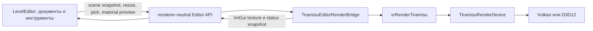

# Текущая реализация Tiramisu Render

> Снимок состояния: 24 июля 2026 года. Tiramisu остаётся стартовым
> прототипом и включается явно. Игровой R4 не удалён и остаётся fallback.

## Главная граница модулей

В процессе существует одно NRI-устройство Tiramisu. Им владеет
`TiramisuRenderDevice` из `xrRenderTiramisu`. LevelEditor больше не создаёт
собственный NRI device, graphics queue или streamer и не линкует NRI напрямую.

`TiramisuEditorRenderBridge` является editor-адаптером основного рендера, а не
вторым renderer. Он находится в `src/Layers/xrRenderTiramisu/Editor`, получает
устройство, очереди и NRI-интерфейсы у `TiramisuRenderDevice`, создаёт нужные
редактору render targets и возвращает наружу только непрозрачные ImGui handles
и структуры состояния.

## Запуск и выбор API

Игра запускает Tiramisu через `-r5`. Vulkan остаётся API по умолчанию,
`-dx12` выбирает D3D12. Для редактора используется `-tiramisu-editor`, а
`-dx12` имеет то же значение.

Все проверки Tiramisu без исключений выполняются с `-rdbg`. Этот аргумент
сохраняет shader debug information и включает согласованную debug policy.
При активном `-renderdoc` конфликтующие NRI/API validation layers отключаются,
но `-rdbg` не убирается.

## Владение ресурсами

`TiramisuRenderDevice` создаёт и уничтожает:

- одно `nri::Device` для выбранного API;
- graphics queue и, когда они доступны, отдельные compute/copy queues;
- NRI Core, Helper, SwapChain, Streamer и ImGui interfaces;
- общий NRI streamer с тремя queued frame contexts.

Игровой viewport и editor bridge создают собственные swapchain/target ресурсы,
но используют одно устройство. Это разные поверхности одного renderer, а не
два независимых renderer. LevelEditor получает экземпляр через C ABI factory
`CreateTiramisuEditorRenderer` и освобождает его тем же модулем через
`DestroyTiramisuEditorRenderer`.

GPU-ресурсы editor viewport не выходят за границу DLL. Публичные интерфейсы:

- `IEditorRenderBackend` принимает scene snapshots, resize, texture uploads и
  запросы picking;
- `IMaterialPreviewRenderer` обслуживает sphere/cube/plane preview;
- `IXrUIRendererBackend` принимает `ImDrawData` и выполняет presentation;
- `FTiramisuEditorRendererInstance` объединяет невладеющие указатели этих
  интерфейсов и непрозрачный lifetime handle.

## Потоки и кадр

Игровой путь имеет game thread и render thread. Game thread обновляет сцену и
публикует команды; NRI recording, pipeline/resource publication и deferred
удаление должны выполняться на render thread. Проверки `CheckIsGameThread` и
`CheckIsRenderThread` фиксируют нарушение контракта в debug-сборке.

Editor bridge пока записывает редакторский кадр из editor presentation path,
но использует renderer-owned device. Его frame scheduler выбирает один из трёх
контекстов, ждёт fence только перед повторным использованием контекста,
обновляет uploads, рисует viewport/preview/ImGui и выполняет present.
Следующая внутренняя задача — провести editor passes через общий
`TiramisuRenderGraph`, не меняя публичный API LevelEditor.

## Сцена редактора

LevelEditor не передаёт `CCustomObject`, `CEditableMesh` или NRI-указатели в
renderer. Он формирует `FEditorViewportSceneSnapshot`:

- mesh uploads с вершинами, индексами и секциями;
- instances с transform, object ID и material overrides;
- material-slot sources или прямые ссылки на новые material assets;
- directional, point и spot lights;
- debug lines/triangles, screen-space overlay и owned text.

Snapshot копируется в mailbox. Renderer дедуплицирует geometry по стабильному
mesh ID/revision, обновляет только изменившиеся buffers, разрешает material
slots и публикует готовые pipeline/resources после fence безопасного frame
context. CPU picker использует тот же snapshot и возвращает object, mesh и
material IDs без раскрытия editor implementation.

Старые `.level` и `.object` остаются import source. Editor может открыть их,
создать native StaticMesh/RenderScene assets, MaterialInstance и обязательный
migration dump. Новая geometry хранится парой `*.static-mesh.json` плюс
`*.static-mesh.bin`: JSON содержит параметры и ссылки, BIN — вершины и индексы.

## Материалы и параметры шейдеров

Material runtime общий для игры, cooker и редактора. Master material задаёт
контракт и static configuration; MaterialInstance хранит static switches и
обычные overrides; dynamic instance меняет только runtime параметры.

Для GPU используются отдельные индексируемые buffers:

- draw data: transform, previous transform, material index и object ID;
- material instance records;
- flattened material parameter data;
- light data.

`NRI_BASE_INSTANCE` выбирает draw record. Из него шейдер получает индекс
material instance, затем offset параметров. Texture и sampler параметры
содержат индексы bindless heap и читаются через `ResourceDescriptorHeap[index]`
и `SamplerDescriptorHeap[index]`. Runtime scalar/vector/texture overrides не
создают новый pipeline; static switches участвуют в permutation key.

Hand-written HLSL и node graph должны прийти к одному `EvaluateMaterial`
контракту. Graph проходит типизацию и генерацию HLSL, после чего оба пути
используют одинаковую DXC/reflection/pipeline-cache цепочку.

## Текущий игровой frame flow

Текущий `TiramisuRenderDeferredPass` ещё не является deferred renderer.
У него нет законченного MRT G-buffer, material resolve и полноценного
отдельного lighting pass. Сейчас упрощённый поток выглядит так:

1. engine публикует render commands;
2. renderer обновляет global constants и material buffers;
3. видимая legacy static geometry рисуется в offscreen color/depth targets;
4. UI/ImGui композится поверх изображения;
5. fullscreen pass выводит результат в swapchain;
6. кадр отправляется на present, а старые ресурсы удаляются после fence.

Название pass отражает целевое направление, а не текущую готовность deferred
PBR. Настоящий G-buffer, clustered lighting, shadows и forward transparency
остаются следующими этапами.

## Что подтверждено

На текущем дереве выполнены:

- полная параллельная Debug-сборка `ALL_BUILD` без `/MP1`;
- отдельная сборка `xrRenderTiramisu` и `LevelEditor`;
- 43 из 43 CTest-тестов с обязательным `-rdbg`;
- проверка generated projects: GPU bridge компилируется в
  `xrRenderTiramisu`, а LevelEditor не линкует `NRI.lib` напрямую.

## Что ещё не готово

- настоящий deferred PBR и clustered lighting в игровом frame loop;
- перенос editor passes на общий render graph executor;
- полный device-loss/resize/restart acceptance;
- async-compute occlusion culling;
- skinned/dynamic/progressive geometry и полный набор world features;
- production postprocessing и R4 effect parity;
- cooked-only runtime без JSON/HLSL compilation;
- полный Tiramisu-only набор инструментов LevelEditor.

До закрытия этих пунктов Tiramisu нельзя считать заменой R4, а Material Editor
нельзя объявлять production-ready только по факту работающего preview.